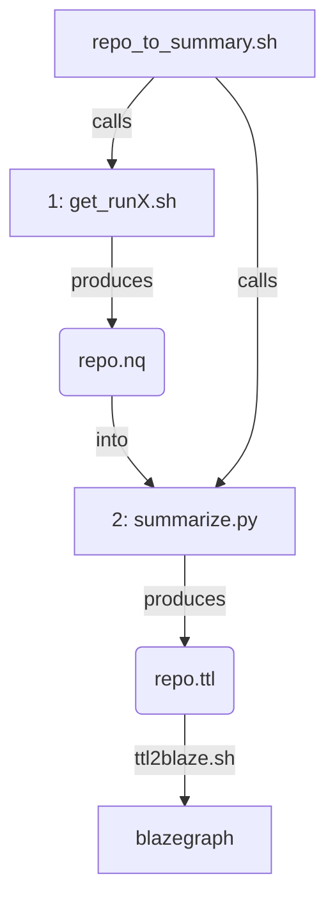

## what you call to run summarization

#### from getting (gleaner) crawler's quad/repo  through making the summary triples, and loading them 
##### once we have a runX fix

as soon as the [system](https://github.com/MBcode/ec/blob/master/system.md) is made more modular, the repo.nq can come from my [crawl](https://github.com/MBcode/ec/tree/master/crawl) as well
